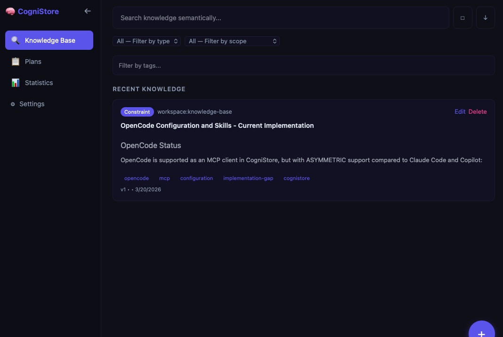

<div align="center">


**Knowledge & Plan Management for AI Agents**

Store, search, and retrieve knowledge using local vector embeddings — directly from your AI assistant.

[](https://github.com/Sithion/cognistore/actions/workflows/ci.yml)
[](https://www.npmjs.com/package/@cognistore/mcp-server)
[](https://github.com/Sithion/cognistore/releases)
[](LICENSE)

[Download](#quick-start) · [Features](#features) · [MCP Integration](#mcp-integration) · [Dashboard](#dashboard) · [Development](#development) · [Patch Notes](PATCH-NOTES.md)



</div>

---

## Overview

CogniStore is a desktop application that gives your AI coding agents a persistent, searchable memory. It runs entirely on your machine — no cloud, no API keys, no data leaving your laptop.

The app acts as an [MCP](https://modelcontextprotocol.io/) server for **Claude Code**, **GitHub Copilot**, and **OpenCode**, allowing your AI assistant to store and retrieve knowledge with semantic search powered by local embeddings.

## Features

- **Local-first** — All data stays on your machine. SQLite database with vector search via `sqlite-vec`.
- **Semantic search** — Find knowledge by meaning, not just keywords. Powered by Ollama embeddings running natively.
- **MCP integration** — Works as a plugin for Claude Code, GitHub Copilot, and OpenCode out of the box. OpenCode also gets a plan enforcement plugin for lifecycle tracking.
- **Zero configuration** — The setup wizard handles everything: Ollama, database, model downloads, MCP config injection, AI skills installation, and system knowledge seeding.
- **System knowledge** — Mandatory protocol entries (type `system`) are seeded on setup, injected into agent sessions via hooks, hidden from the dashboard, and protected from deletion. Agents always operate with the correct protocol without manual configuration.
- **Plans** — Create and manage implementation plans with task lists, priority tracking, relations to knowledge entries, and archive completed plans from the dashboard.
- **Desktop dashboard** — Browse, search, filter, and manage your knowledge base and plans through the built-in UI with stats and charts. All destructive actions use modal confirmations.
- **Auto-update** — The app checks for updates every 30 minutes and installs them automatically.
- **Multi-language** — Dashboard available in English, Spanish, and Portuguese.
- **Cross-platform** — macOS (`.dmg`) and Linux (`.AppImage`, `.deb`).

## Quick Start

### 1. Download

Grab the latest release for your platform from [GitHub Releases](https://github.com/Sithion/cognistore/releases).

| Platform | Format |
|----------|--------|
| macOS (Apple Silicon) | `.dmg` (arm64) |
| macOS (Intel) | `.dmg` (x64) |
| Linux | `.AppImage`, `.deb` |

### 2. Install

Open the downloaded file and drag the app to your Applications folder (macOS) or run the AppImage (Linux).

> **macOS users:** The app is not yet code-signed. If macOS reports the app is damaged, run:
> ```bash
> xattr -cr "/Applications/CogniStore.app"
> ```

### 3. Run the Setup Wizard

On first launch, the setup wizard will automatically:

1. Check and install [Node.js](https://nodejs.org/) v20
2. Install [Ollama](https://ollama.com) (via Homebrew on macOS, curl on Linux)
3. Start the Ollama service
4. Create the local SQLite database at `~/.cognistore/knowledge.db`
5. Pull the `all-minilm` embedding model
6. Configure MCP servers and install AI skills for Claude Code, GitHub Copilot, and OpenCode
7. Seed system knowledge entries (protocol instructions that agents receive automatically via hooks)
8. Mark setup as complete and open the dashboard

Once complete, your AI assistant can immediately start storing and querying knowledge.

## MCP Integration

The MCP server is published to npm and configured automatically by the desktop app.

### Supported Clients

| Client | MCP Config | Instructions |
|--------|-----------|-------------|
| Claude Code | `~/.claude/mcp-config.json` | `~/.claude/CLAUDE.md` |
| GitHub Copilot | `~/.copilot/mcp-config.json` | `~/.github/copilot-instructions.md` |
| OpenCode | `~/.config/opencode/opencode.json` | `~/.config/opencode/AGENTS.md` |

Instructions are compiled from a single source template (`_base-instructions.md`) using platform-specific conditionals, ensuring all three clients receive consistent protocol instructions.

### Manual Setup

If you prefer to configure the MCP server manually:

```json
{
  "mcpServers": {
    "cognistore": {
      "type": "stdio",
      "command": "npx",
      "args": ["-y", "@cognistore/mcp-server"]
    }
  }
}
```

### Available Tools

| Tool | Description | Key Parameters |
|------|-------------|----------------|
| `addKnowledge` | Store one or multiple knowledge entries (single object or array) | `entries` (object or object[]) |
| `getKnowledge` | Search across entries using natural language queries | `query`, `tags`, `type`, `scope`, `limit`, `threshold` |
| `updateKnowledge` | Update an existing entry (re-embeds if tags change) | `id`, `title`, `content`, `tags` |
| `deleteKnowledge` | Remove an entry by ID (rejects system entries) | `id` |
| `listTags` | List all unique tags in the knowledge base | — |
| `healthCheck` | Verify database and Ollama connectivity | — |
| `createPlan` | Create a plan with optional tasks and knowledge relations | `title`, `content`, `tags`, `scope`, `source` |
| `updatePlan` | Update plan title, content, tags, scope, or status | `planId`, `status`, `title`, `content` |
| `addPlanRelation` | Link a knowledge entry to a plan (silently skips system entries) | `planId`, `knowledgeId`, `relationType` |
| `addPlanTask` | Add a task to a plan's todo list | `planId`, `description`, `priority` |
| `updatePlanTask` | Mark task in_progress/completed, add notes | `taskId`, `status`, `notes` |
| `listPlanTasks` | List tasks for a plan ordered by position | `planId` |
| `updatePlanTasks` | Update multiple plan tasks at once | `updates[]` (each with taskId, status?) |

### Knowledge Types

Entries are categorized by type for structured retrieval:

| Type | Use Case |
|------|----------|
| `decision` | Architecture choices, approach trade-offs |
| `pattern` | Code patterns, conventions, reusable solutions |
| `fix` | Bug fixes, error resolutions |
| `constraint` | Tool limitations, version-specific workarounds |
| `gotcha` | Unexpected behaviors, non-obvious pitfalls |
| `system` | Mandatory protocol entries seeded on setup (hidden from dashboard, undeletable) |

### AI Skills

The setup wizard installs skills with lifecycle hooks that enforce knowledge base usage:

- **cognistore-query** — Hooks into `PreToolUse` to remind agents to query before making changes
- **cognistore-capture** — Hooks into `Stop` to remind agents to capture findings before ending a session
- **cognistore-plan** — Hooks into `PostToolUse` (ExitPlanMode) to remind agents to save plans to the knowledge base with task management workflow

Hooks are non-blocking (system messages only) and skip automatically when the agent is already using cognistore tools.

### Hook-Based Protocol Injection

In addition to skills, `UserPromptSubmit` hooks read system knowledge entries (`type=system`) from the database and inject them as a `[COGNISTORE-PROTOCOL]` system message at the start of every agent session. This ensures agents always receive the correct protocol instructions without relying on manual CLAUDE.md configuration alone.

## Dashboard

The desktop app includes a full dashboard with four main pages:

### Knowledge (Home)

- Semantic search with natural language queries
- Filter by type, scope, and tags
- Knowledge cards with title, tag chips, type badges, and similarity scores
- Add new knowledge entries via modal form
- Auto-refresh with polling for new entries

### Plans

- Active plans section showing live task lists with progress bars
- Task status icons: pending (circle), in_progress (spinner), completed (checkmark)
- Priority left-border colors: red (high), yellow (medium), gray (low)
- Mini progress counters and plan relations (input/output sections)

### Stats

- Type and scope distribution charts (pie + bar)
- Plans analytics section with donut charts, area chart, and metric cards
- 15-day activity trend (area chart)
- 90-day contribution heatmap
- Metric cards: total entries, 24h/7d activity, database size
- Tag cloud visualization
- Configurable auto-refresh interval (Off / 1s / 10s / 30s / 1m / 5m)

### Settings

- Service health monitoring (Database, Ollama)
- Real-time status polling every 5 seconds
- Maintenance section with cleanup orphan embeddings button
- Uninstall wizard with 3-step confirmation (removes all data, configs, and dependencies)

## Architecture

```
cognistore/
├── apps/
│   ├── dashboard/          # Tauri v2 desktop app (React + Fastify sidecar)
│   └── mcp-server/         # MCP server (published to npm)
├── packages/
│   ├── shared/             # Types, constants, validation schemas
│   ├── core/               # SQLite + sqlite-vec, data repositories
│   ├── embeddings/         # Ollama embedding client
│   ├── sdk/                # Public SDK (main entry point for consumers)
│   └── config/             # Config injection (Claude, Copilot, OpenCode)
└── scripts/
    ├── bump-version.sh     # Version bump script for all packages
    └── test-agents.sh      # Agent test battery (builds, spins up Docker Ollama, tests all clients)
```

### Tech Stack

| Layer | Technology |
|-------|-----------|
| Desktop shell | Tauri v2 (Rust + WebView) |
| Frontend | React 19 + Vite + Tailwind CSS 4 |
| State management | Redux Toolkit |
| Backend sidecar | Fastify |
| Database | SQLite + sqlite-vec |
| Embeddings | Ollama (native, auto-installed) |
| ORM | Drizzle |
| i18n | react-i18next (EN, ES, PT) |
| Charts | Recharts |
| Monorepo | Turborepo + pnpm |

## Development

### Prerequisites

- [Node.js](https://nodejs.org/) >= 20
- [pnpm](https://pnpm.io/) 9.x
- [Rust](https://rustup.rs/) (for Tauri builds)
- [Ollama](https://ollama.com) (for embedding generation)

### Getting Started

```bash
# Clone the repository
git clone https://github.com/Sithion/cognistore.git
cd cognistore

# Install dependencies
pnpm install

# Build all packages
pnpm build

# Run the dashboard in dev mode
pnpm dev --filter @cognistore/dashboard

# Run the Tauri app in dev mode
pnpm tauri:dev --filter @cognistore/dashboard
```

### Agent Test Battery

The project includes an end-to-end test script that validates MCP tool behavior across all supported AI clients:

```bash
scripts/test-agents.sh
```

The test battery:
1. Builds all packages locally
2. Spins up a Docker-based Ollama instance for isolated embedding generation
3. Creates a temporary local database
4. Swaps MCP configs to point at the local build
5. Runs tool-level tests across Claude Code, GitHub Copilot, and OpenCode
6. Validates similarity scores and response correctness
7. Restores all original configurations on completion (even on failure)

This ensures that MCP tool changes do not regress across any supported client.

### Version Bump

To bump the version across all packages at once:

```bash
pnpm bump <new-version>
# Example: pnpm bump 1.0.0
```

This updates version in all `package.json` files, `Cargo.toml`, and the `LICENSE`.

### Publishing

On merge to `main`, the CI pipeline runs two jobs in parallel:

- **publish-mcp** — Publishes `@cognistore/mcp-server` to npm
- **publish-tauri** — Builds platform binaries (macOS dmg, Linux AppImage/deb) and uploads them to GitHub Releases

## Contributing

Contributions are welcome. Please open an issue first to discuss what you'd like to change.

1. Fork the repository
2. Create a feature branch (`git checkout -b feature/my-change`)
3. Commit your changes
4. Push to the branch and open a Pull Request

## License

[BSL 1.1](LICENSE) — Free for non-commercial use. Converts to Apache 2.0 on 2030-03-18.
